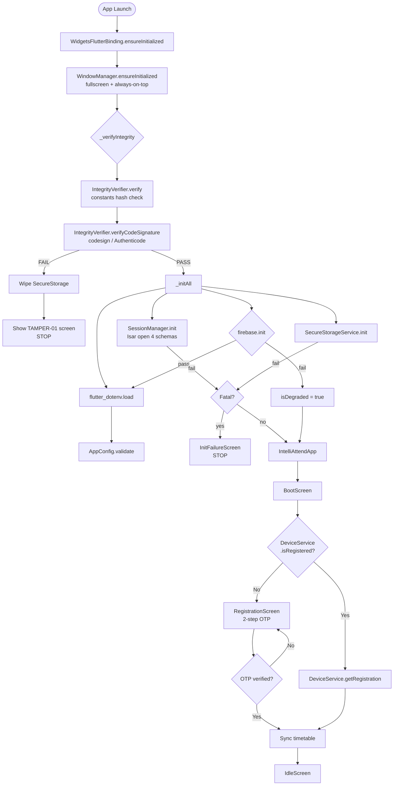
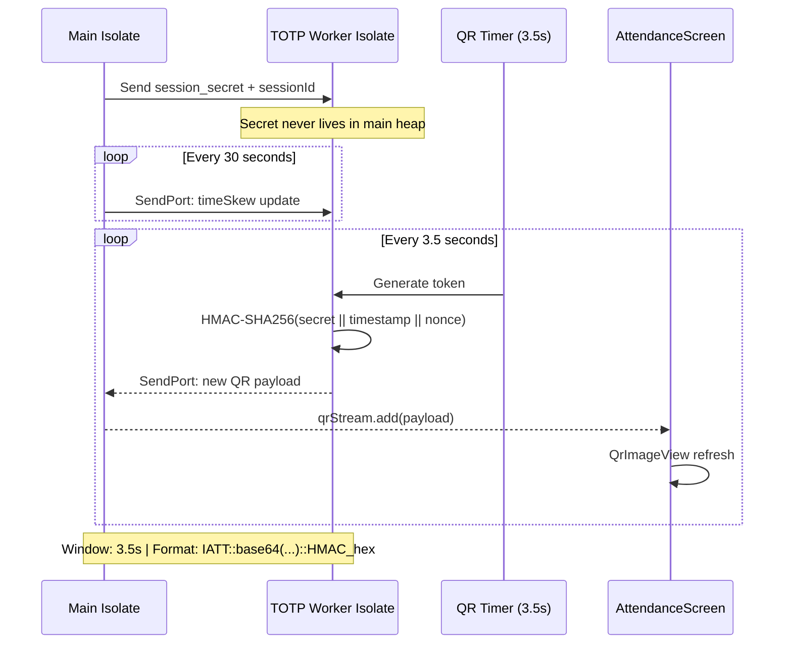
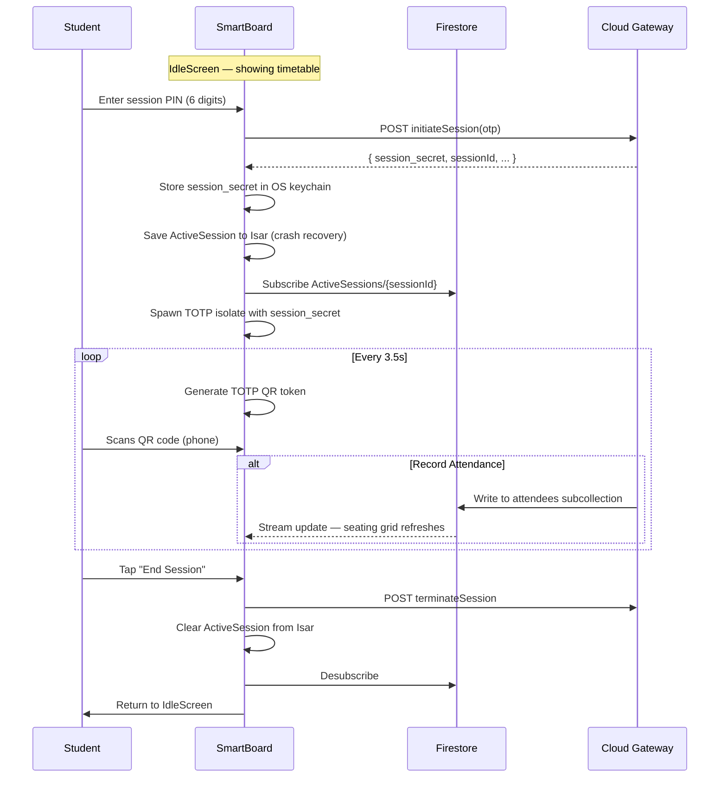
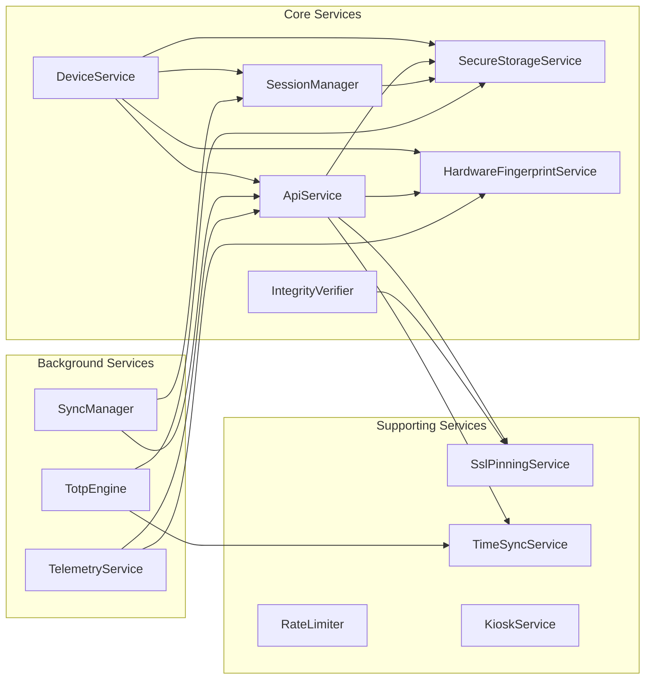
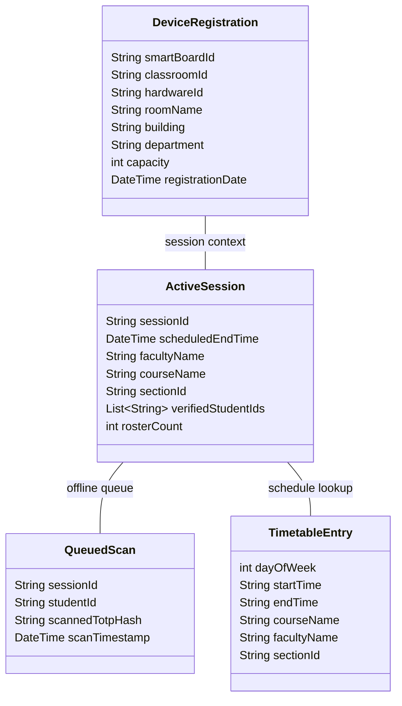
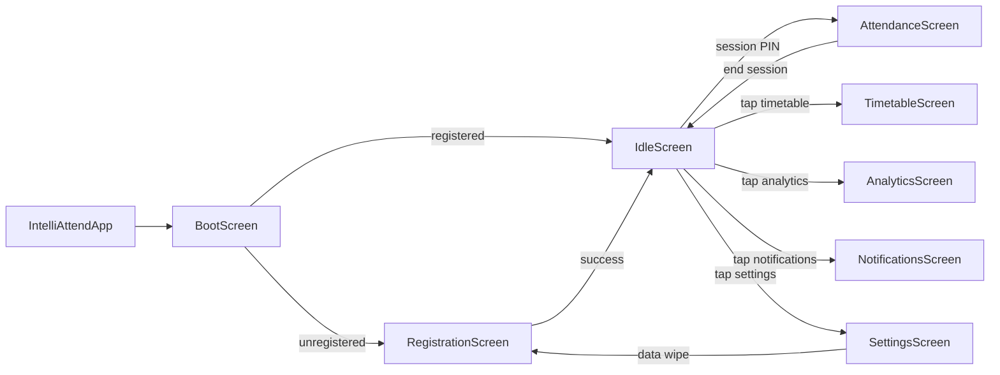

# IntelliAttend SmartBoard — Architecture Diagrams

> **Target:** Windows 99% · Android 1% · macOS (dev only)  
> **Version:** 3.0.0+1 (v5.4.1-STABLE)

---

## 1. System Context Diagram

```mermaid
C4Context
  title System Context — IntelliAttend SmartBoard

  Person(student, "Student", "Scans QR code with phone camera")
  Person(admin, "Admin", "Manages boards, classrooms, timetable")

  System_Boundary(smartboard, "SmartBoard App") {
    System(kiosk, "IntelliAttend SmartBoard", "Flutter desktop kiosk app\nTOTP-based attendance engine")
  }

  System_Ext(firebase, "Firebase", "Firestore (real-time DB)\nFirebase Auth")
  System_Ext(cloudapi, "Cloud Gateway API", "REST API /api/v1/board/*\nRegistration, sessions, vault sync")
  System_Ext(pythonapi, "Local Python API", "\"Brain\" — telemetry ingestion")
  System_Ext(oskeychain, "OS Keychain", "DPAPI (Windows)\nKeychain (macOS)\nlibsecret (Linux)")

  Rel(student, kiosk, "Scans TOTP QR on screen")
  Rel(admin, cloudapi, "Manages boards via admin portal")
  Rel(kiosk, cloudapi, "HTTPS (pinned)", "REST API calls")
  Rel(kiosk, firebase, "SDK (real-time)", "Firestore streams")
  Rel(kiosk, pythonapi, "HTTP", "Telemetry heartbeat")
  Rel(kiosk, oskeychain, "flutter_secure_storage", "Token/session secret storage")
  Rel(kiosk, kiosk, "Isar DB (local)", "Offline cache (4 collections)")
```

---

## 2. Layered Architecture

```mermaid
graph TB
  subgraph "Presentation Layer"
    BS[BootScreen]
    IFS[InitFailureScreen]
    RS[RegistrationScreen]
    IS[IdleScreen]
    AS[AttendanceScreen]
    SS[SettingsScreen]
    TS[TimetableScreen]
    AN[AnalyticsScreen]
    NS[NotificationsScreen]
  end

  subgraph "Service Layer"
    DS[DeviceService]
    API[ApiService]
    SM[SessionManager]
    S3[SecureStorageService]
    HF[HardwareFingerprintService]
    IV[IntegrityVerifier]
    KS[KioskService]
    RL[RateLimiter]
    SYNC[SyncManager]
    TOTP[TotpEngine]
    TEL[TelemetryService]
    TSS[TimeSyncService]
    SSL[SslPinningService]
  end

  subgraph "Data Layer"
    ISAR[(Isar DB\n4 collections)]
    FS[(Firestore\nreal-time)]
    KEYCHAIN[(OS Keychain\nDPAPI/Keychain)]
    ENV[.env file]
  end

  subgraph "Hardware / OS"
    WIN[Windows OS\n(macOS dev)]
    PS[PowerShell\nWMI/CIM]
  end

  BS --> DS
  BS --> SM

  IS --> DS
  IS --> API
  IS --> TOTP

  AS --> TOTP
  AS --> API

  DS --> API
  DS --> SM
  DS --> S3
  DS --> HF
  DS --> FS

  API --> SSL
  API --> S3
  API --> HF
  API --> TSS

  SM --> ISAR

  S3 --> KEYCHAIN

  SYNC --> API
  SYNC --> ISAR

  TOTP --> TSS

  TEL --> HF
  TEL --> API

  HF --> PS

  IV --> ENV
  IV --> WIN

  SSL --> ENV
```

---

## 3. Boot / Initialization Sequence



---

## 4. TOTP QR Generation Flow (Memory-Isolated)



---

## 5. Session Initiation & Attendance Flow



---

## 6. Offline Queue & Sync Flow

```mermaid
flowchart LR
  subgraph "Online Mode"
    A1[Student scans QR] --> A2[ApiService.recordLiveAttendance\n→ Firestore directly]
  end

  subgraph "Offline Mode"
    B1[Student scans QR] --> B2[Write QueuedScan to Isar\n(sessionId, studentId, hash, timestamp)]
  end

  subgraph "Sync Manager"
    C1[connectivity_plus\nconnectivity change] --> C2[Flush all QueuedScan records]
    C3[Timer.periodic\n30 seconds] --> C2
    C2 --> C4[ApiService.syncVault\n→ POST queued scans]
    C4 -->|success| C5[Delete synced rows from Isar]
    C4 -->|failure| C6[Retry next cycle]
  end

  subgraph "Network State"
    D1{Is online?}
  end

  A1 --> D1
  D1 -->|yes| A2
  D1 -->|no| B1

  B2 --> C1
  B2 --> C3
```

---

## 7. Security Architecture

```mermaid
graph TB
  subgraph "Boot-Time Integrity"
    I1[Constants hash check\n(base URL + Firebase project ID)]
    I2[Code signature verification\nAuthenticode / codesign]
    I3[On failure: wipe keychain +\nshow TAMPER-01 screen]
  end

  subgraph "Secret Storage"
    S1[OS Keychain\nDPAPI (Windows)\nKeychain (macOS)]
    S2[flutter_secure_storage\nwrapper]
    S3[NEVER Isar\nNEVER SharedPrefs\n(for secrets)]
  end

  subgraph "Runtime Protections"
    R1[TOTP isolate memory isolation\nsession_secret in worker only]
    R2[Log redaction\nJWT/session_secret stripped]
    R3[SSL pinning\nSHA256/SHA1 fingerprint]
    R4[Rate limiting\n5 attempts / 15 min sliding]
    R5[Volatile clock skew\nRAM only, never persisted]
  end

  subgraph "Network Security"
    N1[Certificate-pinned HTTPS]
    N2[X-Device-ID header\n= hardware fingerprint]
    N3[Bearer token auth]
    N4[X-API-Key fallback]
  end

  subgraph "Kiosk Hardening"
    K1[Fullscreen + always-on-top]
    K2[Windows Assigned Access\n(documented in DEPLOYMENT_WINDOWS.md)]
  end

  I1 --> S1
  I2 --> S1
  S1 --> R1
  S1 --> R2
  R1 --> R3
  R1 --> R4
  R1 --> R5
  R3 --> N1
  R3 --> N2
  R3 --> N3
```

---

## 8. Service Dependency Graph



---

## 9. Isar Schema (4 Collections)



---

## 10. Hardware Fingerprint Composition

```mermaid
graph TD
  subgraph "Entropy Sources (PowerShell Get-CimInstance)"
    E1[Win32_BaseBoard\nSerialNumber]
    E2[Win32_Processor\nProcessorId]
    E3[Win32_NetworkAdapter\nMAC Address]
    E4[Win32_DiskDrive\nSerialNumber]
    E5[Win32_ComputerSystem\nMachineGUID]
  end

  subgraph "Fallback"
    F1[UNKNOWN_MOTHERBOARD]
    F2[UNKNOWN_CPU]
    F3[UNKNOWN_MAC]
    F4[UNKNOWN_DISK]
    F5[UNKNOWN_GUID]
  end

  E1 -->|null or empty| F1
  E2 -->|null or empty| F2
  E3 -->|null or empty| F3
  E4 -->|null or empty| F4
  E5 -->|null or empty| F5

  E1 & E2 & E3 & E4 & E5 --> JOIN[Join with '|' separator]
  JOIN --> SHA256[SHA-256 hash]
  SHA256 --> HEADER["X-Device-ID header\n(all API requests)"]
```

---

## 11. Keychain Storage Map

```mermaid
graph LR
  subgraph "flutter_secure_storage (OS Keychain)"
    K1[api_key]
    K2[access_token]
    K3[refresh_token]
    K4[token_expiry]
    K5[session_secret_{sessionId}]
    K6[idle_break_theme]
  end

  subgraph "SharedPreferences (fallback only)"
    SP1[macOS debug -34018 fallback]
    SP2[Log.e on every use]
  end

  subgraph "Isar (explicitly excluded from secrets)"
    I1[DeviceRegistration]
    I2[ActiveSession]
    I3[QueuedScan]
    I4[TimetableEntry]
  end

  K5 -->|TOTP engine isolate| TOTP
  K2 -->|Bearer auth header| API[ApiService]
  K1 -->|X-API-Key fallback| API
```

---

## 12. Navigation / Route Map


