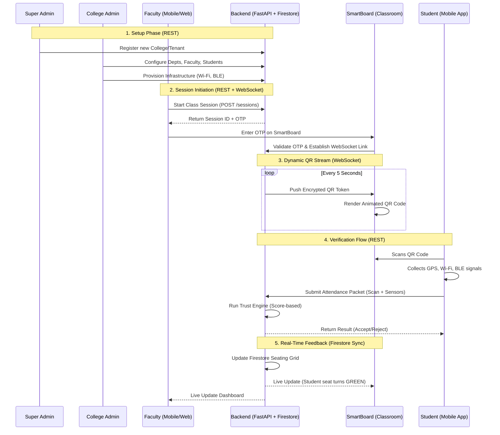

# 📡 System Communication & Coordination Flow

This document explains how the different entities in the IntelliAttend ecosystem (Super Admin, College Admin, Faculty, Student, and Server) interact and communicate.

## 🏗️ High-Level Coordination Diagram

## 🛠️ Communication Channels & Protocols

### 1. REST API (Stateless Communication)
*   **Used By:** All actors for management tasks.
*   **Protocol:** HTTPS / JSON.
*   **Example:** When a College Admin adds a student, or a Super Admin views platform logs.

### 2. WebSockets (Live Data Stream)
*   **Used By:** SmartBoard ↔ Backend.
*   **Protocol:** WSS (Secure WebSockets).
*   **Purpose:** 
    *   **QR Rotation:** The backend "pushes" a new token every 5 seconds. This is more efficient than the SmartBoard "asking" for a token every 5 seconds.
    *   **Low Latency:** Ensures the QR code on the screen never stays valid for more than the rotation window.

### 3. Firestore Real-Time Sync (Document Handlers)
*   **Used By:** Faculty App, SmartBoard, and Student App.
*   **Purpose:** 
    *   **Seating Grid:** As the Backend marks a student "Present," the Firestore document for that session updates. The SmartBoard and Faculty app are "listening" to this document and update the UI instantly (seat turning green).
    *   **Status Updates:** Students see their history update without refreshing.

### 4. Push Notifications (FCM)
*   **Used By:** Backend → Student/Faculty App.
*   **Protocol:** Firebase Cloud Messaging.
*   **Purpose:** Alerting students when a class session is about to start or notifying faculty of anomalies.

---

## 🔄 Coordination by Role

### 🛡️ Super Admin (Platform Anchor)
- **Primary Interface:** Web Dashboard.
- **Coordination:** Sets the "Security Policy" (e.g., GPS radius = 50m). All other components obey these globally pushed configs.

### 🏛️ College Admin (Operational Anchor)
- **Primary Interface:** Web Portal.
- **Coordination:** Feeds the "Entity Data" (Who is a student? Who is faculty?). The server uses this to validate `JWT` tokens during login.

### 👩‍🏫 Faculty (Trigger Actor)
- **Primary Interface:** Mobile App / SmartBoard.
- **Coordination:** Bridges the physical classroom to the digital session. By entering the OTP on the SmartBoard, they "bind" the physical room's hardware to the server's session.

### 👨‍🎓 Student (End-User Actor)
- **Primary Interface:** Mobile App.
- **Coordination:** The "Data Generator." They collect physical signals (Wi-Fi/Bluetooth) and send them to the server for a "handshake" of trust.

---

## 🔒 Security Synchronization
1.  **Shared Secret:** When a session starts, the Backend and SmartBoard share a session-specific secure channel. 
2.  **Time Sync:** All actors use NTP (Network Time Protocol) to ensure the 5-second QR window is synchronized across the Student App, SmartBoard, and Server. 

*Created with ❤️ for the IntelliAttend Architecture Team.*
